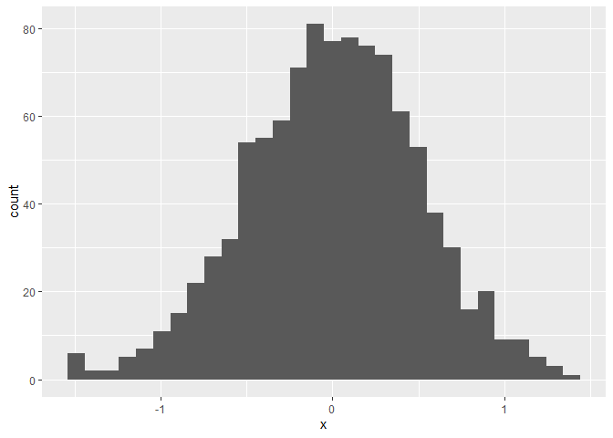
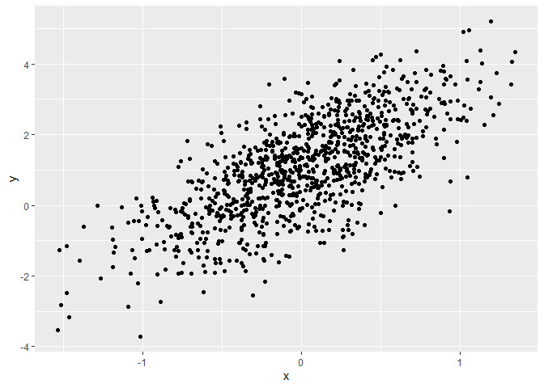
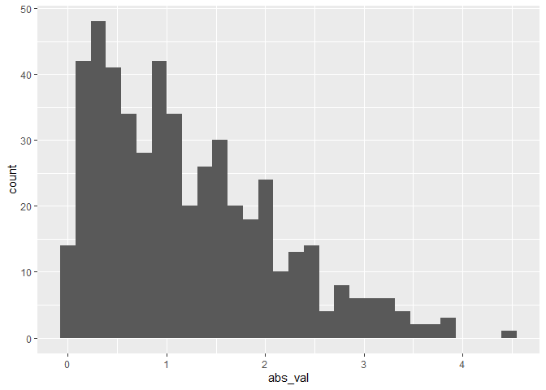

Simple document
================
Sharon Kulali
2023-09-12

I’m an R Markdown document!

# Section 1: First code chunk

Here’s a **code chunk** that samples from a *normal distribution*:

``` r
samp = rnorm(100)
length(samp)
```

# Section 2: Make a plot

This code is borrowed from last lecture; it creates a data frame from
plotting.

``` r
plot_df =
  tibble(
    x = rnorm(1000, sd = 0.5),
    y = 1 +2 * x + rnorm(1000),
  )
```

Next up is a histogram od the `x` variable in `plot_df`

``` r
ggplot(plot_df, aes(x = x)) + geom_histogram()
```

    ## `stat_bin()` using `bins = 30`. Pick better value with `binwidth`.

<!-- -->

Lastly, I’ll do a scatterplot

``` r
ggplot(plot_df, aes(x = x, y = y)) + geom_point()
```

<!-- -->

here’s a list:

- this is the first list thing
- here’s another list item

# Section 3: Learning assessment!

This code chunk should create a dataframe comprised of: a numeric
variable containing a random sample of size 500 from a normal variable
with mean 1; a logical vector indicating whether each sampled value is
greater than zero; and a numeric vector containing the absolute value of
each element.

``` r
la_df = tibble(
     num_samp = rnorm(500, mean = 1),
     log_vec = num_samp > 0,
     abs_val = abs(num_samp)
    )

ggplot(la_df, aes(x = abs_val)) + geom_histogram()
```

    ## `stat_bin()` using `bins = 30`. Pick better value with `binwidth`.

<!-- -->

# Section 4: Text formatting examples

## Text formatting

*italic* or *italic* **bold** or **bold** `code` superscript<sup>2</sup>
and subscript<sub>2</sub>

## Headings

# 1st Level Header

## 2nd Level Header

### 3rd Level Header

## Lists

- Bulleted list item 1

- Item 2

  - Item 2a

  - Item 2b

1.  Numbered list item 1

2.  Item 2. The numbers are incremented automatically in the output.

## Tables

| First Header | Second Header |
|--------------|---------------|
| Content Cell | Content Cell  |
| Content Cell | Content Cell  |
